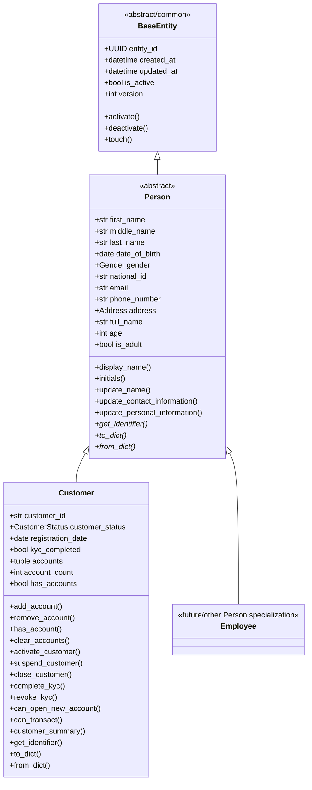
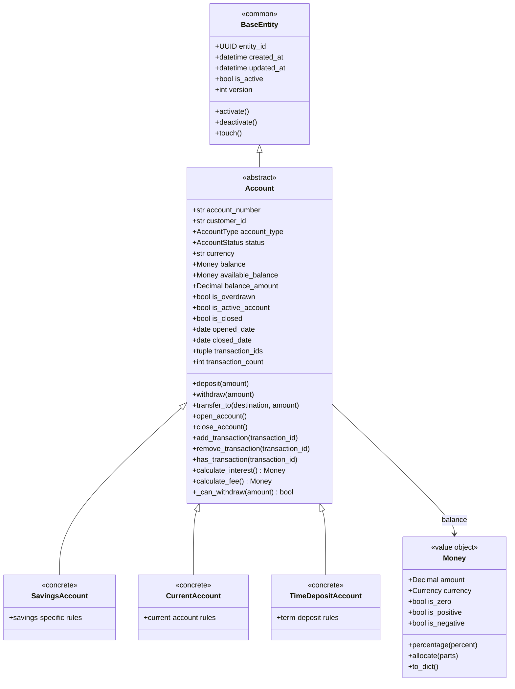
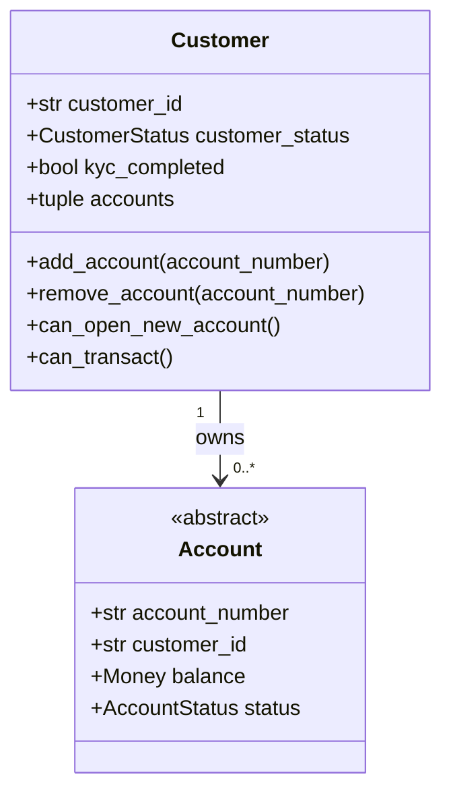
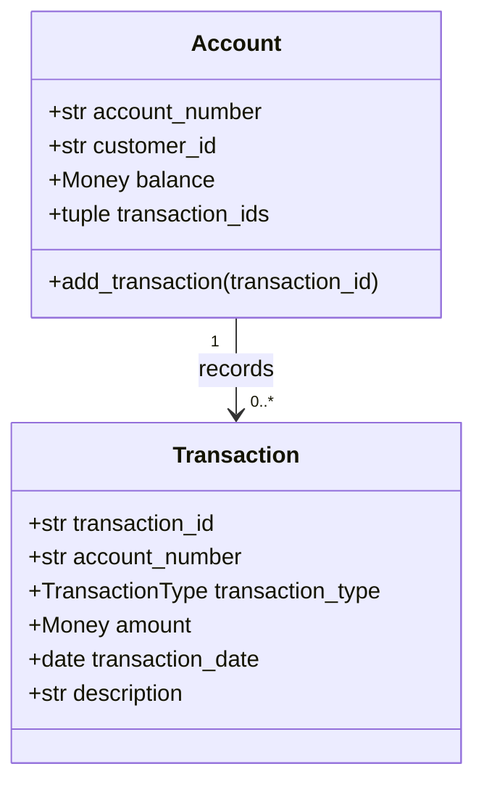
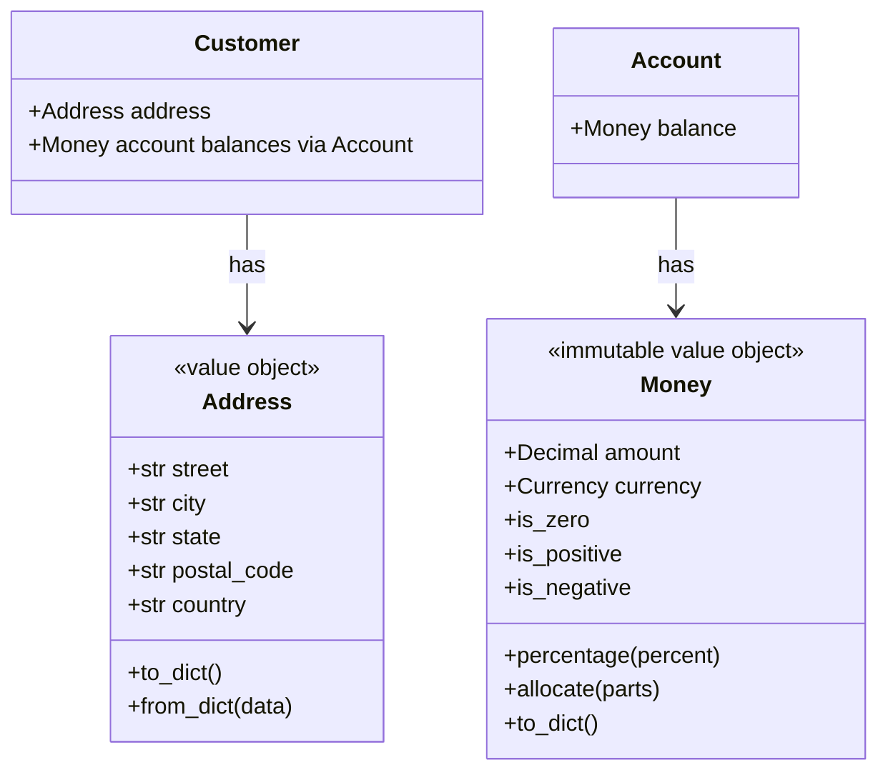
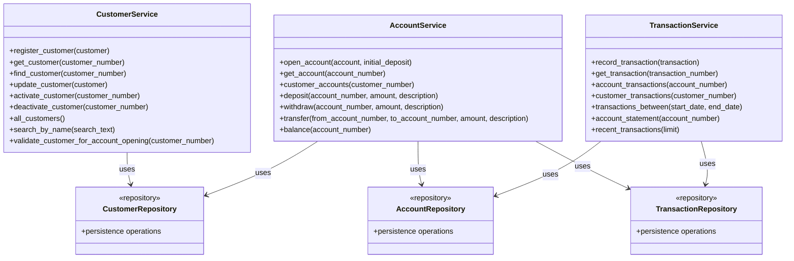
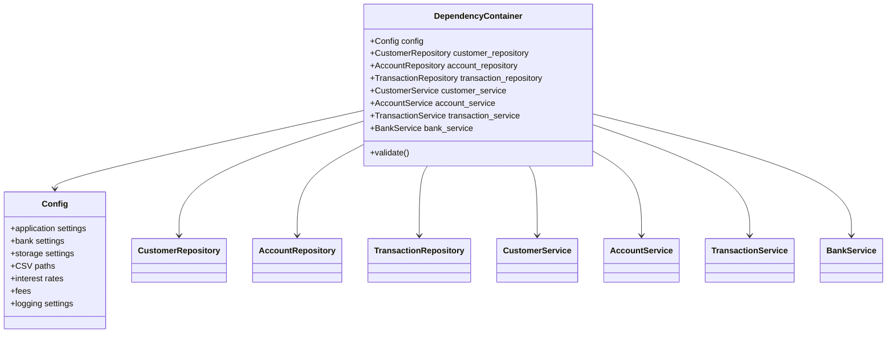
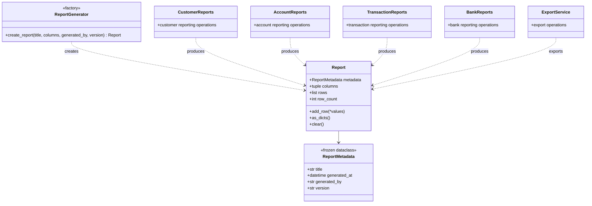
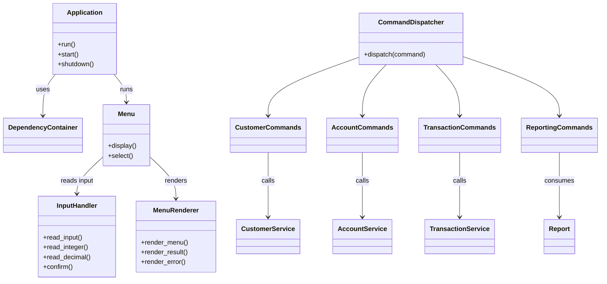
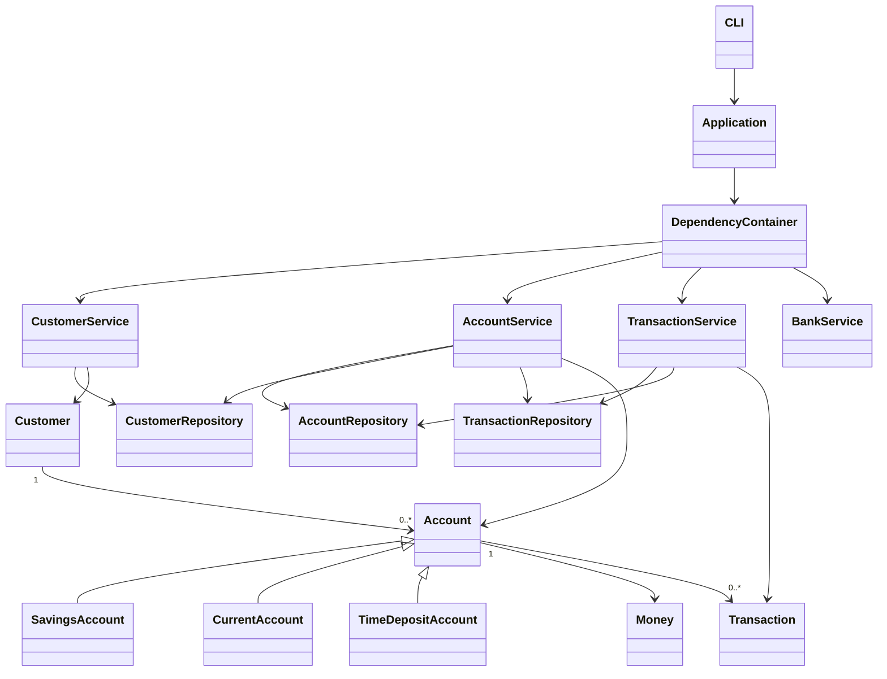

# Banking Management System — Class Diagrams

## 1. Purpose

This document provides the principal structural class diagrams for the current Banking Management System (BMS). The diagrams are written in Mermaid so they remain version-controlled Markdown artifacts and can be rendered by compatible GitHub/documentation viewers.

The diagrams describe the implemented architectural relationships at a useful level of abstraction. The Python source remains authoritative for exact signatures and implementation details.

## 2. Domain Model

The central domain hierarchy demonstrates the project's OOP use of abstraction, inheritance, encapsulation, and polymorphism.



### Interpretation

- `BaseEntity` supplies common entity identity and lifecycle state.
- `Person` is abstract and contains information common to people represented by the system.
- `Customer` specializes `Person` with banking-specific identity, KYC, status, and account associations.
- `Employee` is represented by the existing `Person` abstraction as another possible specialization; the exact implementation should remain synchronized with the source tree.

## 3. Account Hierarchy



### Interpretation

`Account` defines the common banking-account contract. Concrete account types specialize rules such as withdrawal eligibility, interest, fees, or term behavior. The service layer is responsible for coordinating account operations with transaction persistence.

## 4. Customer–Account Relationship



The implementation stores account identifiers on `Customer` and the owning customer identifier on `Account`. This provides the association without making either object responsible for persistence of the other.

## 5. Transaction Relationships



The account retains transaction identifiers while the transaction entity contains the transaction record. The transaction repository provides persistence for the transaction records.

## 6. Value Objects



Value objects encapsulate validation and representation of concepts that should not be treated as primitive strings or numbers throughout the domain.

## 7. Service Layer



### Responsibility boundary

- Repositories persist and retrieve data.
- Services enforce workflow-level rules and coordinate repositories.
- Domain entities own domain state and domain operations.
- CLI components should call services rather than bypassing them for banking workflows.

## 8. Dependency Container



The dependency container acts as the composition root. It ensures application components share the same configured repository and service instances rather than constructing disconnected graphs.

## 9. Reporting Model



## 10. CLI and Application Boundary



## 11. Overall Component/Class Relationship

The following simplified diagram combines the principal layers without showing every method.



## 12. Design Principles Illustrated

### Abstraction

`Person` and `Account` expose abstract contracts while concrete domain classes provide specialized implementations.

### Encapsulation

Domain state is managed through properties and domain methods rather than unrestricted direct mutation.

### Inheritance

`Customer` derives from `Person`; concrete account classes derive from `Account`.

### Polymorphism

Concrete account classes can specialize account operations such as withdrawal eligibility, interest, fees, and other account-specific behavior.

### Composition

Services compose repositories; the dependency container composes the service/repository graph; domain objects compose value objects such as `Money` and `Address`.

## 13. Diagram Maintenance Rules

Update these diagrams when a change affects:

- Class inheritance
- Major class composition
- Service/repository relationships
- Domain associations
- Dependency injection
- Reporting architecture
- CLI/application boundaries

Do not change a diagram merely to represent a proposed future architecture. The diagrams must describe the implemented system.

When exact method signatures are needed, consult [`API_REFERENCE.md`](../api/API_REFERENCE.md) and the Python source.

## 14. Validation

The diagrams are documentation artifacts and do not replace automated tests. The current functional baseline is:

```text
pytest tests/reporting
70 passed in 0.55s

pytest
1,439 passed in 10.35s
```

## 15. Related Documentation

- [`README.md`](../../README.md)
- [`Architecture Guide`](../architecture/ARCHITECTURE_GUIDE.md)
- [`User Guide`](../user/USER_GUIDE.md)
- [`Developer Guide`](../developer/DEVELOPER_GUIDE.md)
- [`Installation Guide`](../installation/INSTALLATION_GUIDE.md)
- [`API Reference`](../api/API_REFERENCE.md)
- `SEQUENCE_DIAGRAMS.md`
