# Banking Management System — Sequence Diagrams

## 1. Purpose

This document describes the principal runtime interactions in the current Banking Management System (BMS). The diagrams use Mermaid sequence-diagram syntax so they remain version-controlled and can be rendered by compatible GitHub/Markdown viewers.

The diagrams describe the implemented application flow at the architectural level. They intentionally avoid inventing infrastructure or external integrations that are not part of the current implementation.

## 2. Participants and Layering

The principal runtime boundaries are:

```text
User / CLI
    |
    v
Application / Commands
    |
    v
Service Layer
    |
    +--> Domain Models
    |
    +--> Repository Layer
              |
              v
         CSV Persistence
```

The application bootstrap prepares storage and constructs the `Application`. The `Application` builds the dependency graph and exposes the `BankService` façade. fileciteturn38file0 fileciteturn39file0

---

## 3. Application Startup

Startup is coordinated by `Bootstrap.initialize()`. It initializes storage, validates storage readiness, and then constructs the `Application`. fileciteturn38file0

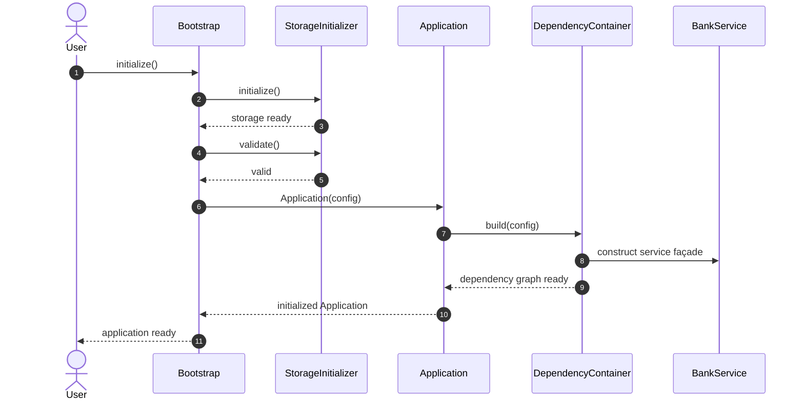

If storage validation fails, bootstrap raises a `RuntimeError` and does not return a running application. fileciteturn38file0

---

## 4. Application Health and Shutdown

The `Application` exposes the bank façade, configuration, running-state check, and graceful shutdown. The running-state check delegates to dependency-container validation. fileciteturn39file0

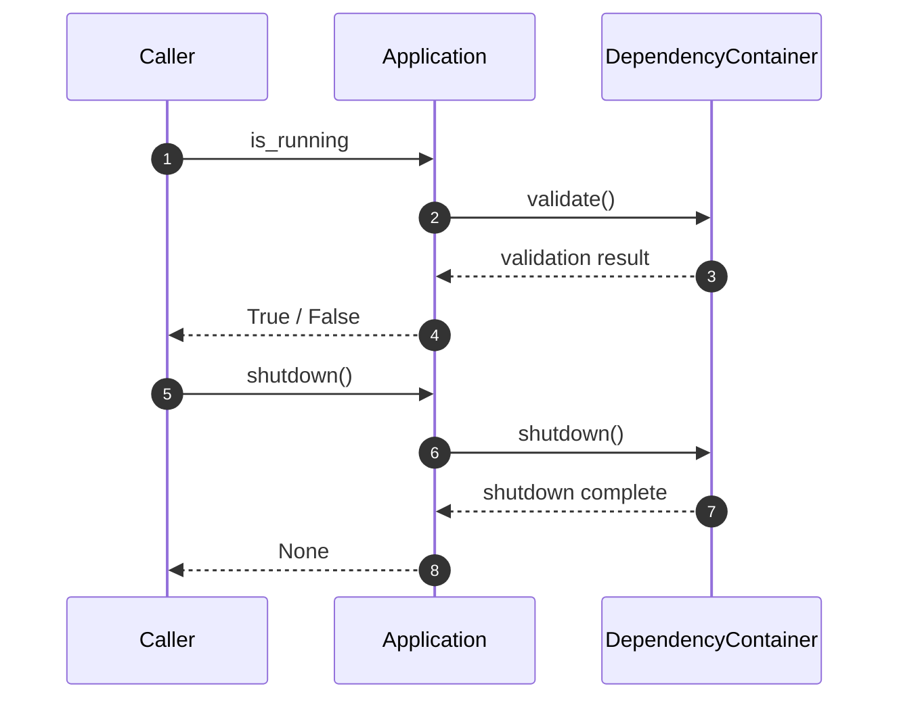

---

## 5. Customer Registration

Customer registration follows the normal presentation-to-service-to-repository direction. The CLI collects user input; the service validates and persists the customer through the repository.

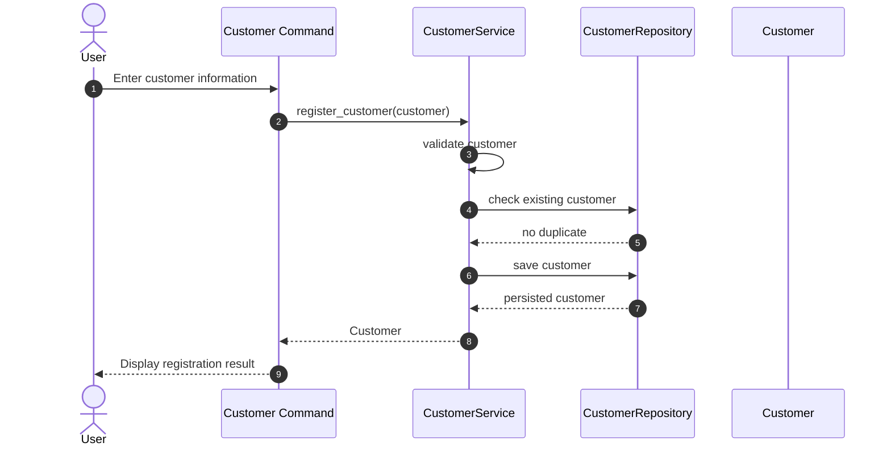

The exact validation rules and repository method names remain implementation-defined by the current service/repository source.

---

## 6. Account Opening

Account opening is coordinated by the account service. The service validates the customer and account, persists the new account, and can process an optional initial deposit.

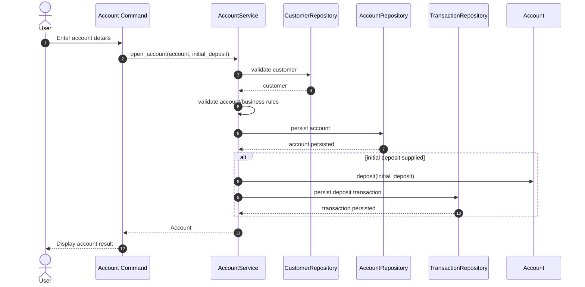

The diagram shows the service boundary rather than exposing repository construction or persistence details to the CLI.

---

## 7. Deposit

A deposit changes account state and creates the corresponding transaction record through the application/service workflow.

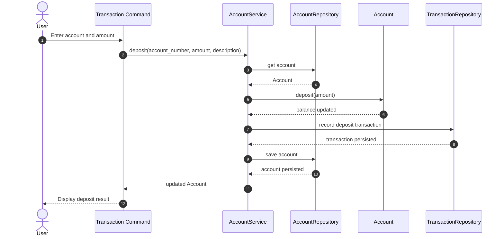

The transaction and account persistence operations are represented at the service boundary because the service coordinates the financial workflow.

---

## 8. Withdrawal

Withdrawal follows the same general workflow but includes account-level validation of whether the requested amount can be withdrawn.

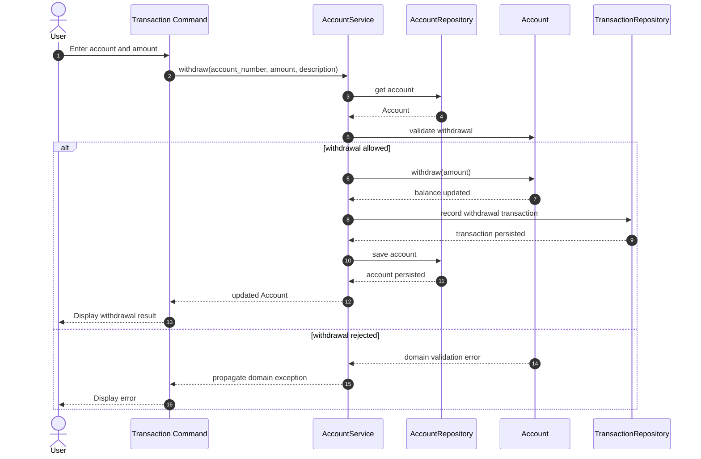

---

## 9. Internal Account Transfer

An internal transfer involves a source account and destination account. The service validates both accounts, prevents invalid self-transfers, applies the debit/credit operation, and records the resulting transaction workflow.

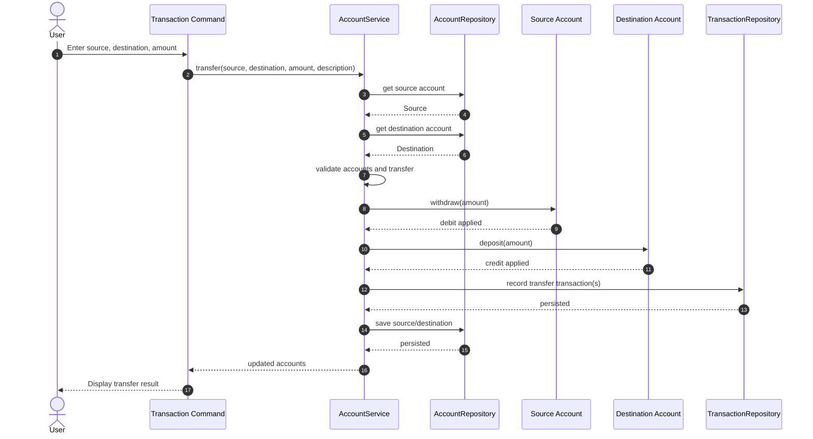

If the source and destination identifiers are identical or either account fails validation, the workflow terminates with the relevant domain/application error rather than applying the transfer.

---

## 10. Transaction History / Statement

Transaction history is read through the transaction service and repository. The service can provide account-level transactions, recent transactions, date-range queries, and statement-oriented data.

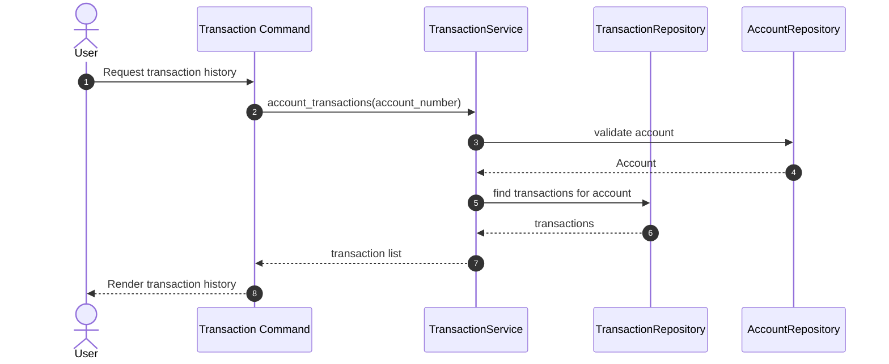

---

## 11. Reporting

Reporting reads application/domain data and transforms it into report-oriented structures. The reporting layer is deliberately separated from core banking transaction logic.

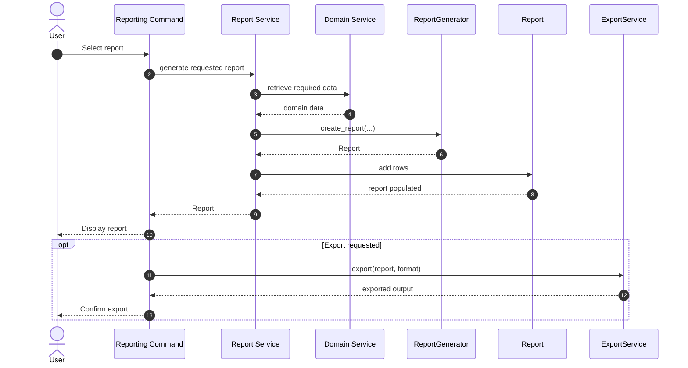

---

## 12. Persistence Boundary

The application uses CSV-backed persistence. The important architectural rule is that service operations cross the repository boundary rather than allowing the CLI to manipulate CSV files directly.

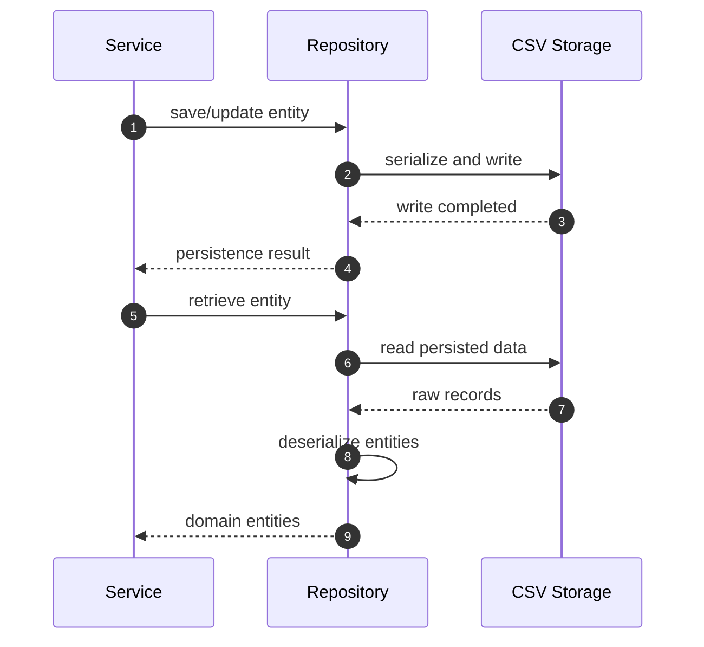

---

## 13. Error Propagation

Expected business failures originate at the layer that owns the relevant rule and propagate upward until the presentation layer can render a useful message.

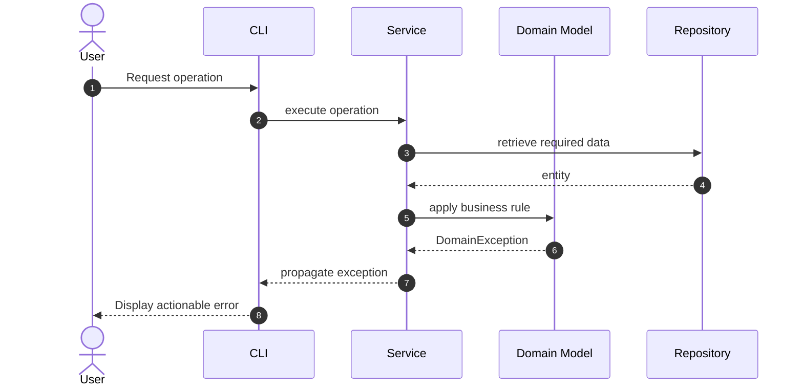

The application should preserve specific domain exceptions instead of converting every failure into a generic exception.

---

## 14. Complete Daily Banking Workflow

The following sequence combines the principal user-facing operations into a realistic workflow.

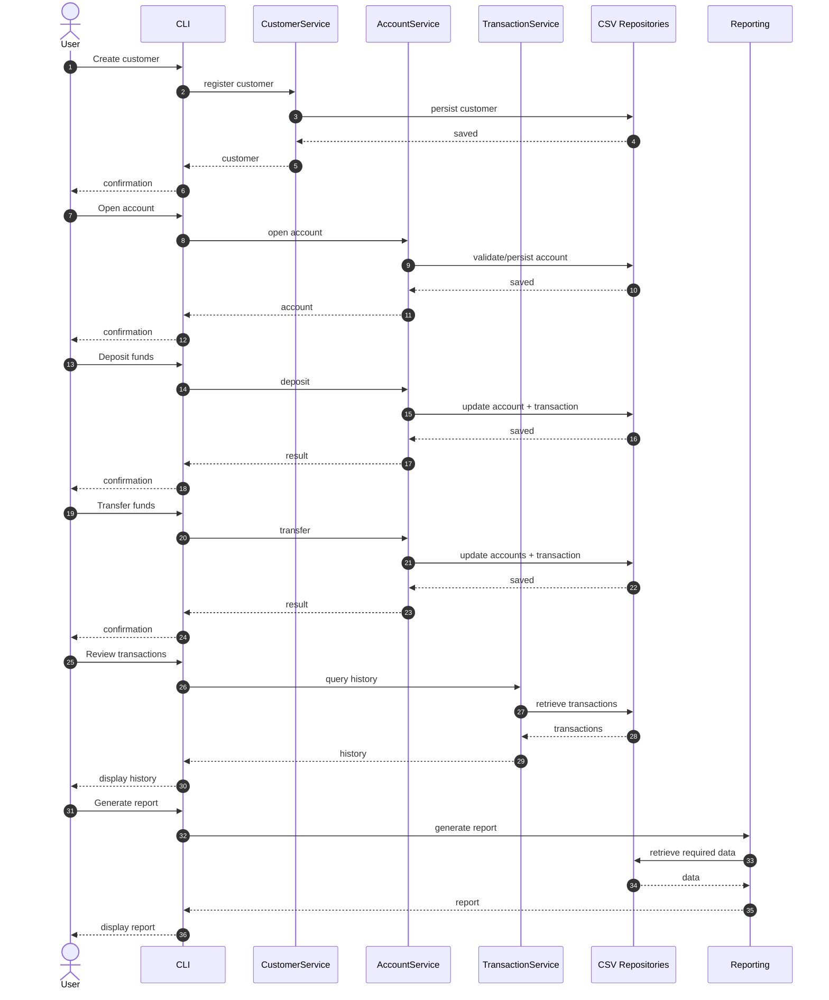

---

## 15. Diagram-to-Architecture Mapping

| Workflow | Primary component | Persistence | Main concern |
|---|---|---|---|
| Startup | `Bootstrap` / `Application` | Storage initializer | Runtime readiness |
| Customer registration | `CustomerService` | Customer repository | Customer lifecycle |
| Account opening | `AccountService` | Account/customer repositories | Account eligibility and creation |
| Deposit | `AccountService` | Account/transaction repositories | Credit operation |
| Withdrawal | `AccountService` | Account/transaction repositories | Debit and balance validation |
| Transfer | `AccountService` | Account/transaction repositories | Coordinated debit/credit |
| History | `TransactionService` | Transaction repository | Transaction retrieval |
| Reporting | Reporting services | Domain repositories/services | Transformation and presentation |
| Shutdown | `Application` | Dependency container | Graceful lifecycle termination |

## 16. Design Principles Illustrated

The sequence diagrams demonstrate the following architectural principles:

1. **Separation of concerns** — CLI, services, repositories, domain objects, and reporting have distinct responsibilities.
2. **Dependency inversion through composition** — application startup constructs the dependency graph centrally.
3. **Service orchestration** — multi-step banking workflows are coordinated by services rather than CLI commands.
4. **Domain encapsulation** — account balance operations are performed by domain objects.
5. **Persistence isolation** — CSV storage is accessed through repositories.
6. **Explicit error propagation** — domain/application failures remain distinguishable to callers.
7. **Reporting separation** — reporting transforms data without becoming the owner of banking business rules.

## 17. Source-of-Truth Rule

These diagrams document the current architecture and intended runtime interaction represented by the source code and tests. They must be updated when a workflow's component boundaries, orchestration responsibilities, or persistence behavior materially changes.

The source code remains authoritative when a diagram and implementation disagree.

## 18. Related Documentation

- [`README.md`](../../README.md) — project overview
- [`Architecture Guide`](../architecture/ARCHITECTURE_GUIDE.md) — architecture and design
- [`User Guide`](../user/USER_GUIDE.md) — user workflows
- [`Developer Guide`](../developer/DEVELOPER_GUIDE.md) — development practices
- [`Installation Guide`](../installation/INSTALLATION_GUIDE.md) — installation
- [`API Reference`](../api/API_REFERENCE.md) — public APIs
- [`Class Diagrams`](CLASS_DIAGRAMS.md) — static class relationships
